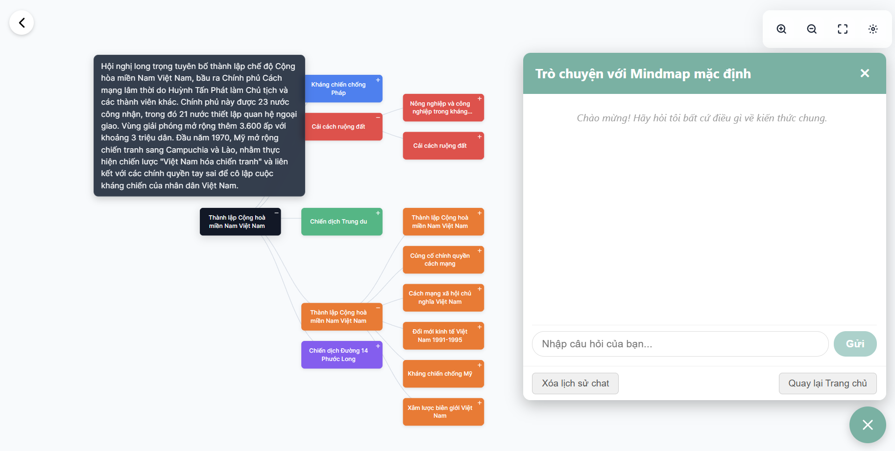
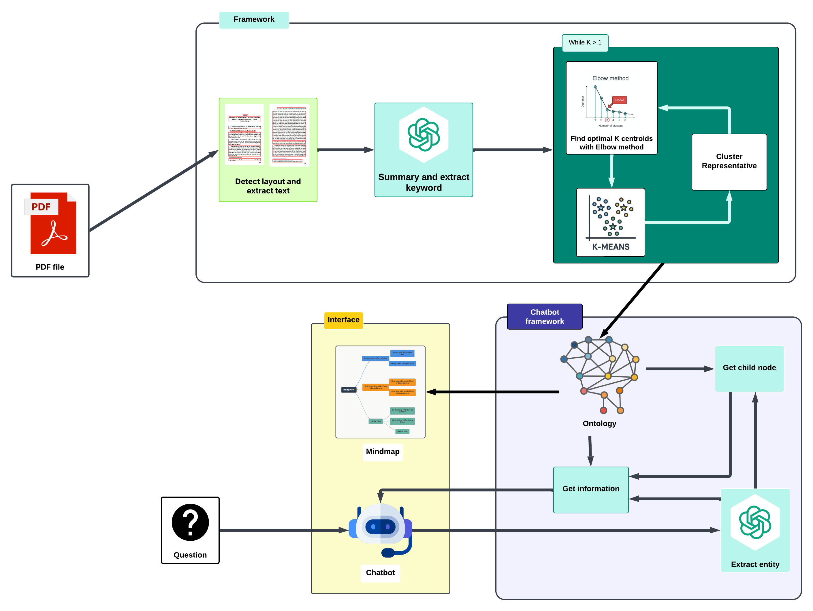

# Hệ thống trực quan hóa tri thức lịch sử với sự hỗ trợ của trí tuệ nhân tạo

Hệ thống sẽ giúp trực quan hóa tài liệu thành MindMap. Giúp người đọc tiếp thu kiến thức một cách trực quan. Hệ thống còn có một trợ lý để giúp người dùng trò chuyện với kiến thức lịch sử trong tài liệu của mình. Ngoài ra, nếu bạn muốn tìm hiểu kiến thức lịch sử việt nam giai đoạn 1945-2000 hệ thống cũng sẽ giúp bạn trả lời nhanh chóng.

---
## Demo hệ thống

---
## Framework

## Yêu cầu hệ thống

Trước khi bắt đầu, hãy đảm bảo bạn đã cài đặt các công cụ sau:

* Python 3.12: Để chạy phần backend.
* Node.js & npm: Để chạy phần frontend (Vue.js).
* Redis Server: Dùng cho backend.
* Flask: để chạy server

---

## Thiết lập Backend

Backend của dự án yêu cầu **Python 3.12** và **Redis Server**.

### 1. Cài đặt Redis Server

* Đối với Linux/macOS:
    Bạn có thể cài đặt Redis thông qua trình quản lý gói của hệ điều hành. Ví dụ:
    ```bash
    sudo apt update
    sudo apt install redis-server
    ```
    hoặc
    ```bash
    brew install redis
  ```
* Đối với Windows:
    Chúng tôi khuyến khích sử dụng **Windows Subsystem for Linux (WSL)** để chạy Redis Server.

    1.  Cài đặt WSL (nếu chưa có) theo hướng dẫn của Microsoft.
    2.  Mở WSL terminal và chạy các lệnh cài đặt Redis như trên Linux.
    3.  Khởi động Redis Server trong WSL:
    ```bash
        sudo service redis-server start
    ```
    Bạn có thể kiểm tra trạng thái Redis bằng:
    ```bash
    redis-server
    ```
    Nếu trả về PONG, Redis đang chạy thành công.

### 2. Thiết lập môi trường Python

Chúng tôi khuyến khích tạo một môi trường ảo bằng **Conda** để quản lý các gói phụ thuộc.

1.  Tạo môi trường Conda:
    ```bash
    conda create -n ten_moi_truong_cua_ban python=3.12
    ```
    (Thay ten_moi_truong_cua_ban bằng tên bạn muốn, ví dụ: my_project_env)

2.  Kích hoạt môi trường:
   ```bash
    conda activate ten_moi_truong_cua_ban
```
3.  Cài đặt các gói phụ thuộc:
    Đi đến thư mục gốc của dự án backend (nơi chứa file requirements.txt) và chạy:
```bash
    pip install -r requirements.txt
```
### 3. Chạy Backend

Sau khi cài đặt Redis và các gói phụ thuộc, bạn có thể chạy backend:

1.  Đảm bảo Redis Server đang chạy.
2.  Kích hoạt môi trường Conda của bạn (nếu chưa).
3.  Di chuyển đến thư mục gốc của backend.
4.  Chạy ứng dụng backend:
    ```bash
    python server.py
    ```
---
## Thiết lập Frontend

Frontend của dự án được xây dựng với **Vue.js**.

### 1. Cài đặt gói phụ thuộc

Di chuyển đến thư mục gốc của frontend và cài đặt các gói cần thiết:
```bash
cd front_end/web_frontend
npm install
```
### 2. Chạy Frontend

Sau khi cài đặt xong, bạn có thể chạy ứng dụng frontend:
```bash
npm run dev
```
Thao tác này sẽ khởi động máy chủ phát triển và thường mở ứng dụng trong trình duyệt của bạn tại http://localhost:3001

---

Chúc bạn thành công khi chạy dự án! Nếu có bất kỳ vấn đề nào, đừng ngần ngại mở một issue.
